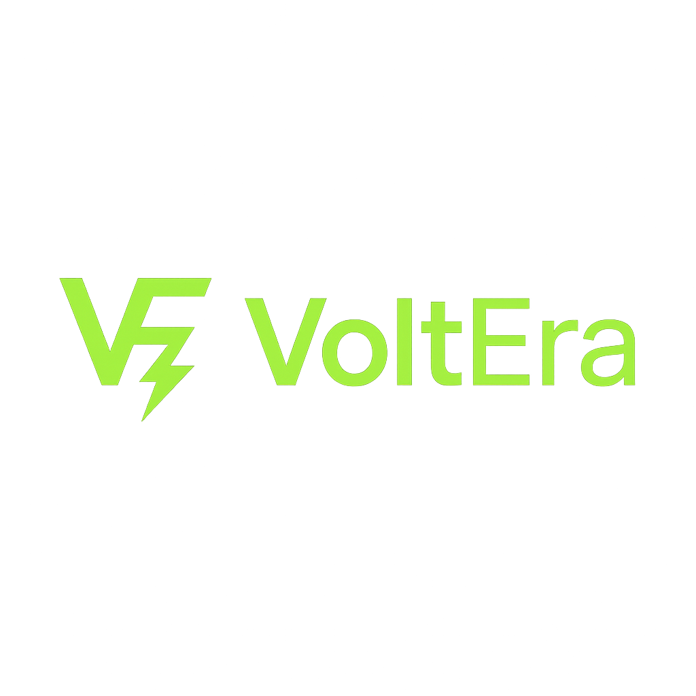

**A infraestrutura solar descentralizada para a nova era da computação**

*Energia autônoma • Computação distribuída • Soberania digital*

---

## 🧭 Visão Geral

A **VoltEra** é uma rede de **mini data centers solares autônomos**, projetada para **descentralizar o poder computacional** atualmente concentrado em Big Techs como Google, Microsoft e Amazon.

Cada unidade VoltEra é um **nó energético e computacional autossuficiente**, capaz de gerar sua própria energia, armazenar dados localmente e participar de uma **rede P2P global** de computação verde.

> ⚡ “A VoltEra transforma energia solar em poder computacional livre.”

---

## 🌞 O Conceito

O **VoltEra Node** combina:
- **Energia Renovável** (painéis solares + baterias LiFePO₄)
- **Compute de Alta Performance** (CPU/GPU server-grade)
- **Storage Descentralizado** (IPFS, Storj ou Sia)
- **Rede P2P Segura** (WireGuard + LibP2P)
- **Monitoramento IA** (autobalanceamento de energia e carga)

Cada nó pode operar **de forma isolada (off-grid)** ou **como parte de uma rede global**, redistribuindo energia, poder de processamento e armazenamento.

*Arquitetura técnica da rede solar descentralizada VoltEra*

---

## 🔩 Camadas Técnicas

| Camada | Função | Tecnologias |
|--------|--------|-------------|
| **Energia** | Geração solar + armazenamento local | MPPT, LiFePO₄, 48VDC bus, inversores híbridos |
| **Computação** | Execução de containers e IA local | K3s, Docker, GPU AMD/NVIDIA, Ryzen/EPYC |
| **Storage** | Armazenamento distribuído e redundante | IPFS, Sia, Storj |
| **Rede** | Conexão P2P criptografada | WireGuard, Tailscale, LibP2P |
| **Orquestração IA** | Distribuição dinâmica de workloads | Python, Node-RED, MQTT, OpenAI API |
| **Dashboard Global** | Visualização e controle de todos os nós | Next.js, Supabase, Grafana |
| **Token de Incentivo** | Economia descentralizada da rede | Smart Contracts (ERC-20 / Polygon) |

---

## 🧱 O Produto

### 🧩 VoltEra Node (Unidade Base)
Um **módulo autônomo de computação e energia**, operando 100% com energia solar.

**Especificações:**
- Painéis solares: 2,5–4 kWp
- Baterias: 10–15 kWh LiFePO₄
- Inversor híbrido: 5 kVA / 48 V
- CPU: Ryzen 7 / Xeon Silver
- RAM: 64–128 GB ECC
- Storage: 8–20 TB SSD + IPFS Sync
- Rede: 10 GbE / LTE / Mesh Wi-Fi
- Consumo médio: 400–800 W
- Refrigeração: Ativa + Free Cooling
- Controle: VoltEra Dash + API REST

---

## 🛰️ Rede Global VoltEra

### 🌐 Topologia
Cada **VoltEra Node** é parte de uma **rede mesh descentralizada**:
- Sincroniza dados e cargas computacionais entre pares
- Redistribui energia solar excedente localmente
- Opera mesmo offline (sync assíncrono)
- Balanceia tarefas por IA (proximidade, energia, carga)

### ⚙️ Operações Distribuídas
- Renderização de IA e vídeo  
- Hospedagem de serviços locais  
- Armazenamento descentralizado (dApp / web3)  
- Execução de agentes e LLMs locais  

---

## 🔒 Segurança e Autonomia

### ⚡ Energética
- Painéis + Baterias LiFePO₄ (autonomia 24–48h)
- Gestão térmica e PUE < 1.3
- Proteção elétrica completa (SPD, DR, UPS)

### 🔐 Digital
- Criptografia ponta a ponta (AES-256 + WireGuard)
- Autenticação federada e zero-trust
- Ledger blockchain para verificação de uptime e energia
- Compliância LGPD / ISO 27001

---

## 📊 VoltEra Cloud Dashboard

### 🌍 Painel Global
- Status de todos os nós ativos
- Geração solar vs consumo
- Workloads executando
- Recompensas de tokens
- Métricas ambientais (CO₂ evitado, uptime, temperatura)

### 🔔 Alertas Inteligentes
- Excedente energético disponível
- Queda de produção solar
- Falha em nó remoto
- Desvio térmico

---

## 💰 Modelo de Negócio

### 💎 Hardware
- **Node Base**: R$ 65.000  
- **Node Pro (GPU)**: R$ 95.000  
- **Node Enterprise (Cluster)**: sob consulta  

### ☁️ Serviços e Rede
- **VoltEra Cloud Access**: R$ 199/mês  
- **Analytics + IA Distribuída**: R$ 299/mês  
- **Node Operator Rewards**: até 12% ROI anual via tokens

---

## 📈 Roadmap 2025–2026

| Período | Etapa |
|----------|-------|
| **Q1 2025** | MVP Node funcional + integração solar |
| **Q2 2025** | Rede local P2P + IPFS Sync |
| **Q3 2025** | VoltEra Cloud Dashboard + token interno |
| **Q4 2025** | Beta público de rede descentralizada |
| **Q2 2026** | Lançamento comercial global |

---

## 🧩 Parcerias Estratégicas

- 🌞 **Fabricantes de Energia Solar**
- 🧠 **Plataformas de IA Distribuída**
- 🖥️ **Fabricantes de Servidores Edge**
- 🌐 **Infraestrutura Web3**
- 🧪 **Centros de P&D e Universidades**

---

## 🏆 Diferenciais VoltEra

| Pilar | Descrição |
|--------|-----------|
| **Descentralização Real** | Computação e energia independentes das Big Techs |
| **Energia Verde Autônoma** | 100% solar, com armazenamento local |
| **Rede Global P2P** | Interconexão segura e autobalanceada |
| **Economia Colaborativa** | Cada nó é um ativo que gera valor |
| **IA Integrada** | Gerenciamento e orquestração inteligentes |
| **Sustentabilidade Transparente** | Métricas públicas de eficiência e CO₂ evitado |

---

## ⚖️ Conformidade e Licença

**Regulamentações:**
- Lei 14.300/2022 — Microgeração Distribuída  
- REN 1098/2024 — Geração Local ANEEL  
- LGPD / ISO 27001 / ISO 50001  

**Licença:** Proprietária © 2025 VoltEra Technologies  
Uso comercial e redistribuição não autorizados sem consentimento.

---

**VoltEra Technologies**  
*Descentralizando energia e computação — uma revolução solar.*

*© 2025 VoltEra Technologies. Todos os direitos reservados.*

