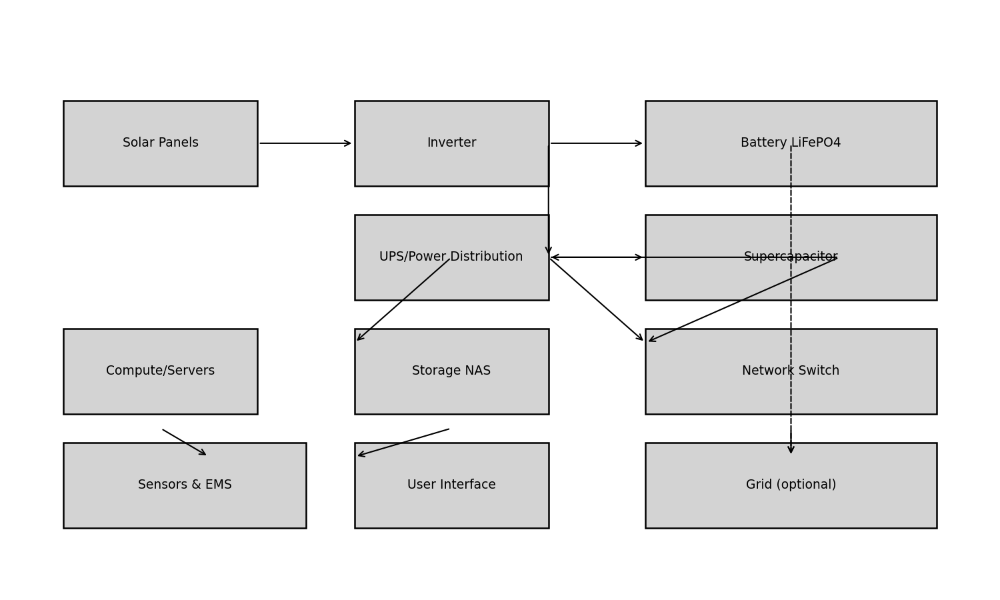

# VolTera 🚀⚡

**O futuro dos datacenters residenciais para gamers profissionais**

*Autonomia energética • Performance extrema • Sustentabilidade*

---

## 🎯 Visão Geral

VolTera revoluciona a infraestrutura de gaming profissional ao oferecer **mini-datacenters modulares** que combinam energia renovável, computação de alto desempenho e redundância enterprise em escala residencial.

### 🚀 O Produto

O **VolTera Gamer Rack** é um datacenter doméstico que oferece:

- **🌞 Energia Autônoma**: Painéis solares + baterias LiFePO4 + supercapacitores
- **🎮 Performance Pro**: Servidores dedicados, GPUs RTX/MI, storage RAID
- **🔒 Redundância Total**: Dupla redundância em energia, rede e refrigeração
- **📱 Controle Inteligente**: App VolTera Control com métricas em tempo real

*Arquitetura técnica do sistema VolTera*

---

## 🎮 Para Quem?

### 👨‍💻 Streamers Profissionais
- Encoding dedicado 24/7
- Zero dependência de serviços externos
- Backup automático de conteúdo

### 🏆 Pro Players & E-sports
- Latência ultra-baixa
- Servidores dedicados para treino
- Performance consistente

### 🏢 Estúdios de Gaming
- Solução escalável para equipes
- Gerenciamento centralizado
- Múltiplas VMs simultâneas

---

## ⚡ Especificações Técnicas

### 🔋 Sistema de Energia
- **Geração Solar**: 1-2 kWp (painéis portáteis)
- **Armazenamento**: 5-10 kWh LiFePO4
- **Autonomia**: 6-12 horas sem rede
- **Eficiência**: PUE < 1.2

### 💻 Computação
- **CPU**: AMD Threadripper / Intel Xeon
- **GPU**: RTX 4090/5090 / AMD MI-series
- **RAM**: 64-256 GB ECC
- **Storage**: NAS RAID-6 (50-100 TB)

### 🌐 Conectividade
- **Switch**: 10 GbE com failover
- **Internet**: Dual WAN com SD-WAN
- **Wi-Fi**: Wi-Fi 7 (opcional)
- **Latência**: < 1ms local

### ❄️ Refrigeração
- **Ativa**: Ventilação forçada + loop líquido
- **Passiva**: Free-cooling noturno
- **Temperatura**: 18-27°C (ASHRAE)
- **Ruído**: < 35 dB

---

## 🛡️ Segurança & Conformidade

### 🔒 Física
- Rack com vidro temperado e chave
- Biometria / RFID
- Câmeras internas
- Detecção de intrusão

### 🌐 Lógica
- Firewall enterprise
- VPN dedicada
- Monitoramento SOC 24/7
- Compliance LGPD

### 📋 Certificações
- **TIA-942-C**: Infraestrutura de datacenter
- **ASHRAE**: Controle térmico
- **NFPA 75**: Proteção contra incêndio
- **ISO 27001**: Segurança da informação
- **ISO 50001**: Gestão energética

---

## 📊 Dashboard & Monitoramento

### 📱 VolTera Control App
- **Performance**: FPS, latência, recursos
- **Energia**: Geração solar, consumo, economia
- **Ambiente**: Temperatura, umidade, ruído
- **Sustentabilidade**: CO₂ evitado, badges verdes

### 🔔 Alertas Inteligentes
- Falhas de hardware
- Picos de temperatura
- Quedas de rede
- Níveis de bateria

---

## 🌱 Sustentabilidade

### ♻️ Impacto Ambiental
- **Energia Limpa**: 80% solar durante o dia
- **Economia Circular**: Componentes recicláveis
- **Eficiência**: 60% menos consumo vs setup tradicional
- **Certificação**: Selo verde de sustentabilidade

### 📈 Métricas Verdes
- CO₂ evitado em tempo real
- Economia de energia mensal
- Pegada carbono vs alternativas
- Contribuição para ODS da ONU

---

## 🚀 Roadmap 2025

| Período | Marco |
|---------|-------|
| **Q1 2025** | MVP + Protótipo funcional |
| **Q2 2025** | Testes com beta users |
| **Q3 2025** | Pré-lançamento + Certificações |
| **Q4 2025** | Launch comercial Brazil |

---

## 💰 Modelo de Negócio

### 💎 Hardware Premium
- **Starter**: R$ 45.000 (5 kWh)
- **Pro**: R$ 75.000 (10 kWh)
- **Enterprise**: R$ 120.000 (custom)

### 📱 Software & Serviços
- **VolTera Control**: R$ 99/mês
- **Cloud Backup**: R$ 49/mês
- **Suporte 24/7**: R$ 199/mês

### 🔧 Serviços Profissionais
- Instalação e configuração
- Manutenção preventiva
- Upgrades de hardware
- Consultoria energética

---

## 📁 Documentação Técnica

### 📋 Documentos Disponíveis

- **[📊 Executive Summary](VolTera_Executive_Summary.md)**: Visão estratégica e modelo de negócio
- **[🏗️ PRD & Architecture](VolTera_PRD_and_Architecture.md)**: Requisitos técnicos e arquitetura
- **[⚖️ Compliance & Regulation](VolTera_Compliance_and_Regulation.md)**: Normas e certificações
- **[🛡️ Risk Management](VolTera_Risk_and_Mitigation.md)**: Análise de riscos e mitigações
- **[📖 Operations Manual](VolTera_Operations_Manual.md)**: Manual de operação
- **[🚀 Startup Guide](VolTera_Startup_Guide.md)**: Guia de implementação

### 📊 Planilhas e Dados

- **[💰 Financial Model](VolTera_Financial_Model.xlsx)**: Projeções financeiras
- **[⚠️ Risk Register](VolTera_Risk_Register.xlsx)**: Registro de riscos
- **[✅ Compliance Register](VolTera_Compliance_Register.xlsx)**: Status de conformidade
- **[🗓️ Roadmap](VolTera_Roadmap.csv)**: Cronograma de desenvolvimento
- **[🔧 Bill of Materials](VolTera_BOM.xlsx)**: Lista de componentes

---

## 🤝 Parcerias e Investimento

### 🎯 Buscamos

- **💰 Investimento Seed**: R$ 8 milhões
- **🤝 Parcerias**: Fabricantes de GPU, streaming platforms
- **🏢 Clientes Beta**: Streamers e pro players
- **🔬 P&D**: Universidades e centros de pesquisa

### 📞 Contato

- **🌐 Website**: [voltera-dash.vercel.app](https://voltera-dash.vercel.app/)
- **📧 Email**: contato@voltera.com.br
- **💼 LinkedIn**: /company/voltera-gaming
- **🐦 Twitter**: @VolTeraGaming

---

## 🏆 Diferenciais Competitivos

### 🎮 Gaming-First Design
- Interface otimizada para gamers
- Estética premium RGB
- Integração com plataformas de streaming

### 🌞 Sustentabilidade Real
- Primeira solução 100% renovável do mercado
- Métricas ambientais transparentes
- Economia circular implementada

### 🏢 Nível Datacenter
- Redundâncias enterprise
- SLA de 99.9% uptime
- Monitoramento profissional

### 🇧🇷 Made in Brazil
- Desenvolvimento nacional
- Suporte em português
- Adequação à regulação brasileira

---

## 📜 Licença e Conformidade

Este projeto está protegido por direitos autorais e contém informação proprietária da VolTera Gaming Technologies.

**Regulamentação Brasileira:**
- Lei 14.300/2022 (Microgeração Distribuída)
- REN 1098/2024 ANEEL
- LGPD (Lei Geral de Proteção de Dados)

---

**VolTera Gaming Technologies**  
*Democratizando o acesso a infraestrutura de datacenter de alta performance*

*© 2025 VolTera Gaming Technologies. Todos os direitos reservados.*

